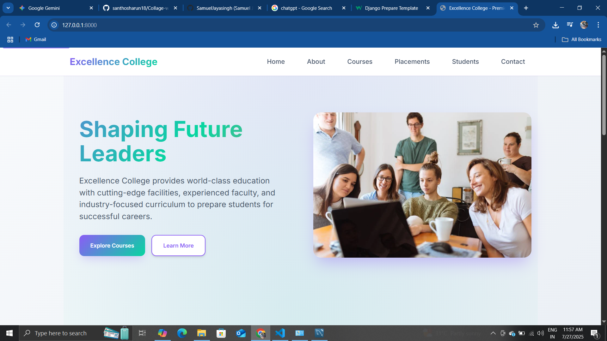
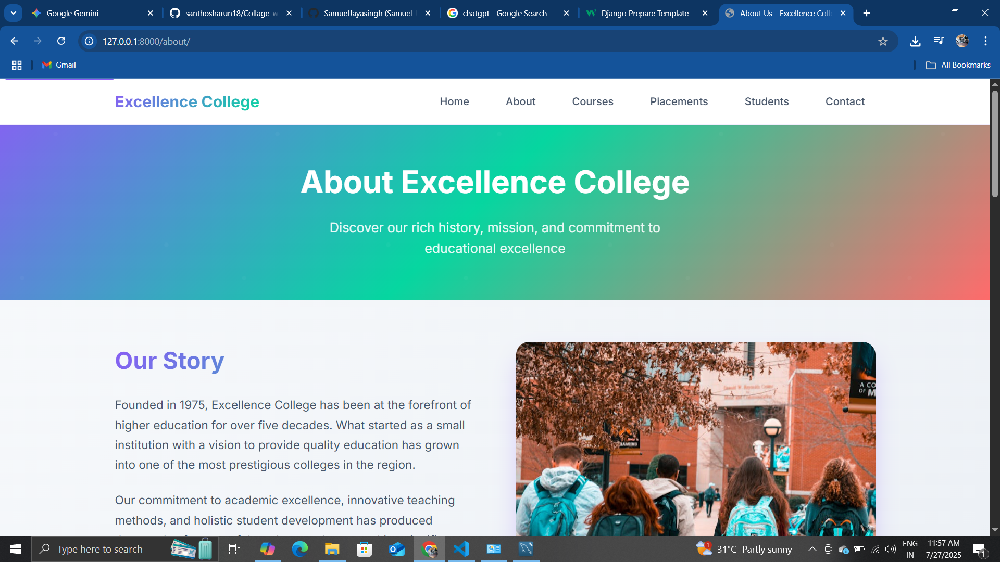
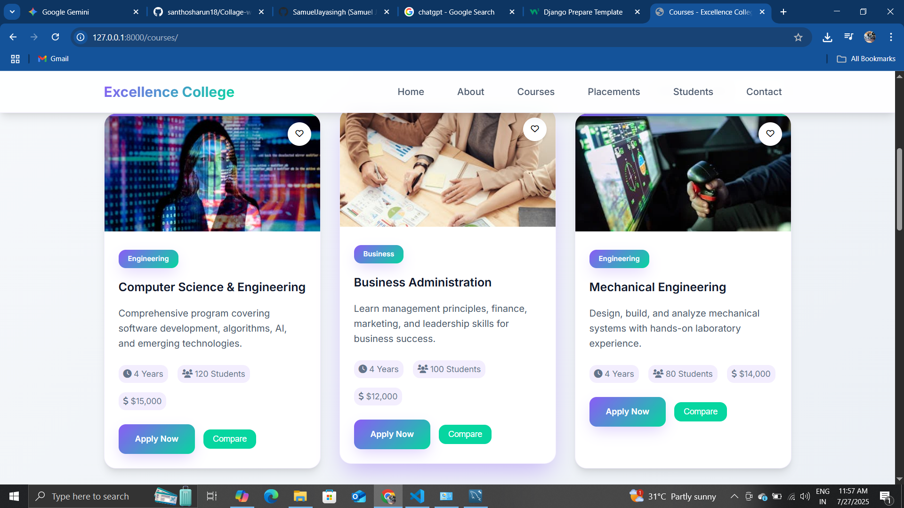
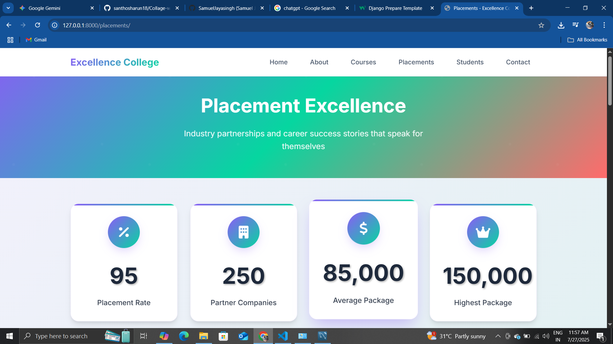
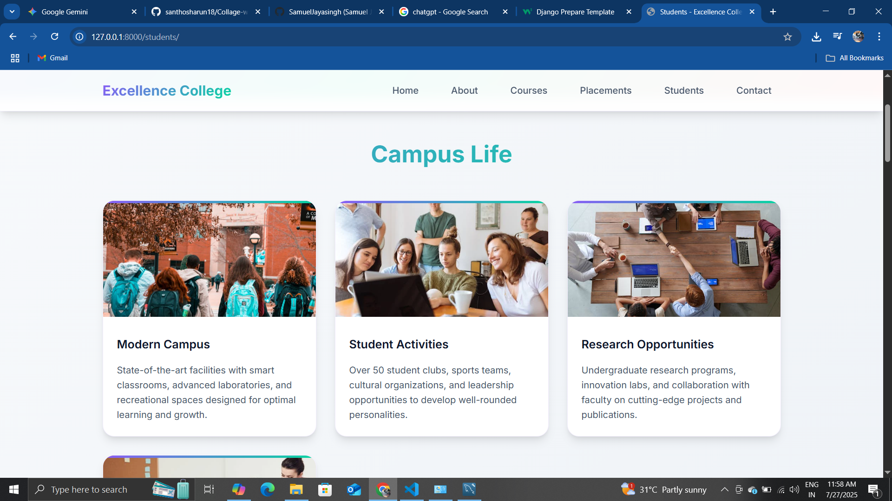
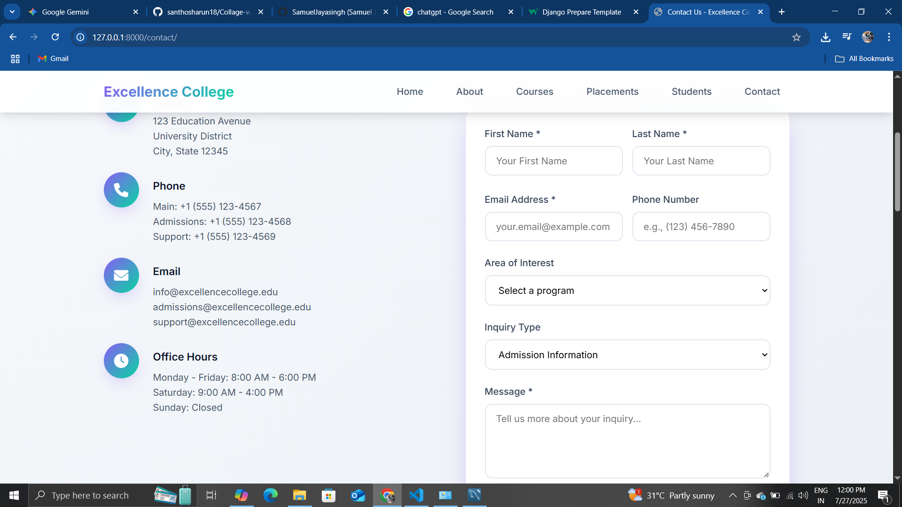

# College Website using Django

This project is a dynamic college website built using the Django web framework. It provides essential information about the college, including courses, contact details, and student-related pages, offering a comprehensive online presence.

## Features

  * **Home Page:** An engaging landing page for the college.
  * **About Us:** Information about the college's history, mission, and values.
  * **Courses:** Details about various academic programs offered.
  * **Contact Us:** A form for visitors to get in touch with the college administration.
  * **Placements:** Information related to college placements (if `placements.html` is used for this purpose).
  * **Students:** Pages possibly dedicated to student resources or information.
  * **Responsive Design:** Utilizes CSS for a user-friendly experience across devices.
  * **Dynamic Content:** Leverages Django's templating and database capabilities for managing content.

## Technologies Used

  * **Backend:**
      * Python
      * Django
      * MySQL (for database management)
  * **Frontend:**
      * HTML5
      * CSS3
      * JavaScript

## File Structure

The project follows a standard Django project structure with a main project (`college_site`) and an app (`main`).

```
.
├── college_site/                 # Main Django project directory
│   ├── __pycache__/
│   ├── asgi.py
│   ├── settings.py               # Project settings
│   ├── urls.py                   # Main URL configurations
│   └── wsgi.py
├── main/                         # Django app for core functionalities
│   ├── __pycache__/
│   ├── migrations/               # Database migrations
│   │   ├── __pycache__/
│   │   ├── 0001_initial.py
│   │   └── 0002_alter_contactmessage_options_and__.py
│   ├── static/                   # Static files (CSS, JS, Images)
│   │   ├── css/
│   │   │   └── main.css
│   │   ├── images/
│   │   │   └── javascript.svg
│   │   └── js/
│   │       ├── contact.js
│   │       ├── courses.js
│   │       ├── main.js
│   │       └── navigation.js
│   ├── templates/                # HTML templates
│   │   └── main/
│   │       ├── about.html
│   │       ├── contact.html
│   │       ├── courses.html
│   │       ├── index.html
│   │       ├── pexels-pixabay-207580.jpg  # Image used in templates
│   │       ├── placements.html
│   │       └── students.html
│   ├── __init__.py
│   ├── admin.py                  # Django admin configurations
│   ├── apps.py
│   ├── forms.py                  # Forms for user input (e.g., contact form)
│   ├── models.py                 # Database models
│   ├── tests.py
│   ├── urls.py                   # App-specific URL configurations
│   └── views.py                  # View logic for pages
├── db.sqlite3                    # Default SQLite database (can be replaced by MySQL)
├── manage.py                     # Django's command-line utility
└── README.md                     # This file
```

## Setup and Installation

To set up and run this project locally, follow these steps:

1.  **Clone the repository:**

    ```bash
    git clone <your-repository-url>
    cd <your-repository-name>
    ```

2.  **Create a virtual environment (recommended):**

    ```bash
    python -m venv venv
    source venv/bin/activate  # On Windows: venv\Scripts\activate
    ```

3.  **Install dependencies:**

    ```bash
    pip install Django mysqlclient  # You might need to install 'mysqlclient' dependencies based on your OS
    ```

    *Note: For `mysqlclient`, you might need to install development headers for MySQL (e.g., `sudo apt-get install libmysqlclient-dev` on Debian/Ubuntu, or follow specific instructions for your OS).*

4.  **Configure MySQL Database:**

      * Create a MySQL database for your project.
      * Update your `college_site/settings.py` file with your MySQL database credentials:

    <!-- end list -->

    ```python
    DATABASES = {
        'default': {
            'ENGINE': 'django.db.backends.mysql',
            'NAME': 'your_database_name',
            'USER': 'your_mysql_user',
            'PASSWORD': 'your_mysql_password',
            'HOST': 'localhost',  # Or your MySQL host
            'PORT': '',           # Default MySQL port is 3306
        }
    }
    ```

5.  **Run Migrations:**

    ```bash
    python manage.py makemigrations
    python manage.py migrate
    ```

6.  **Create a Superuser (optional, for admin access):**

    ```bash
    python manage.py createsuperuser
    ```

7.  **Run the Development Server:**

    ```bash
    python manage.py runserver
    ```

    The website should now be accessible at `http://127.0.0.1:8000/`.

## Screenshots

### 🔹 Homepage


### 🔹  About


### 🔹  Courses


### 🔹  Placement


### 🔹  Students


### 🔹  Contact Form


## Contributing

If you'd like to contribute to this project, please follow these steps:

1.  Fork the repository.
2.  Create a new branch (`git checkout -b feature/your-feature-name`).
3.  Make your changes.
4.  Commit your changes (`git commit -m 'Add new feature'`).
5.  Push to the branch (`git push origin feature/your-feature-name`).
6.  Open a Pull Request.

## License

[Specify your license here, e.g., MIT License, GNU GPLv3, etc.]

## Contact

Santhosh Arun - [santhosharun31@gmail.com]

-----
